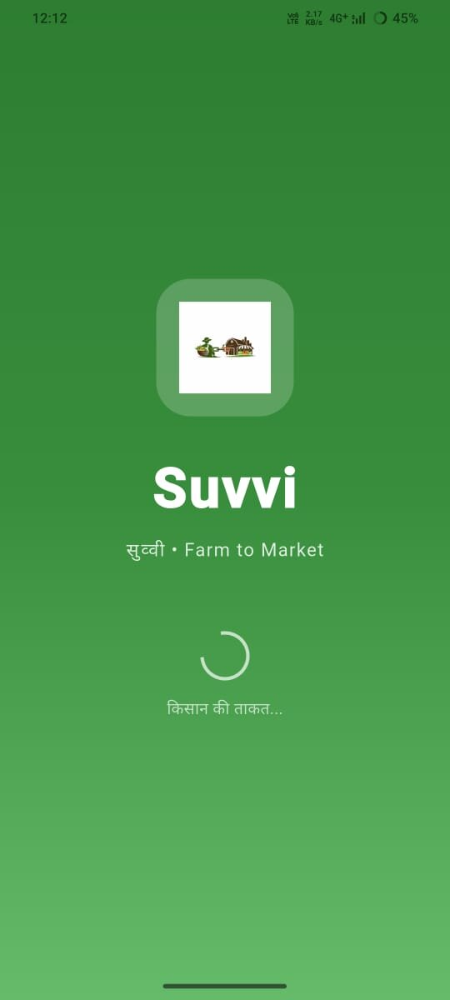
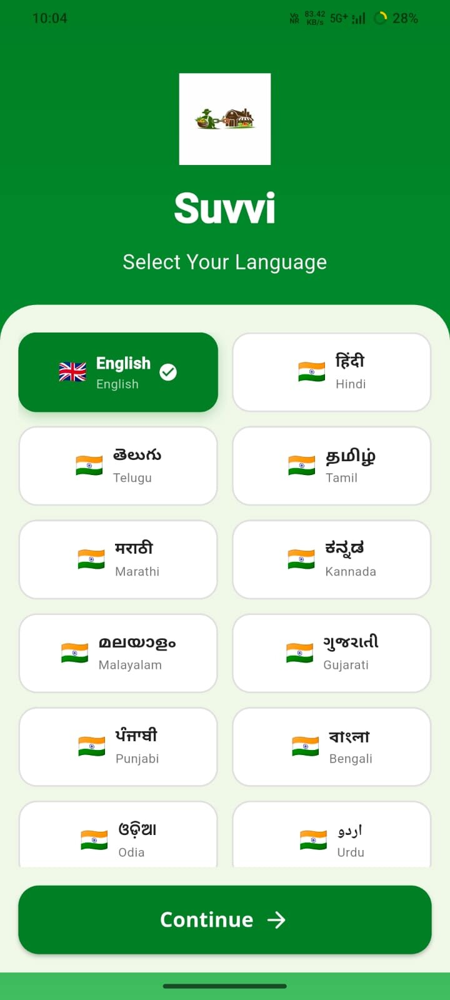
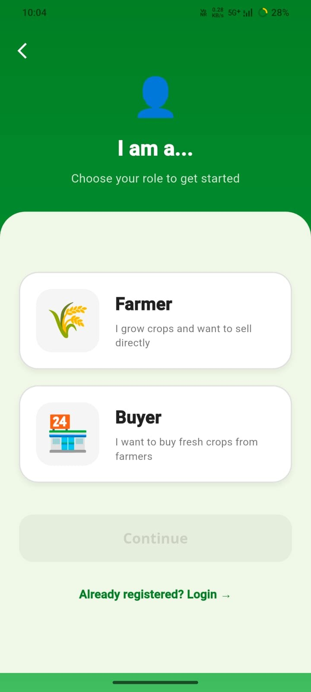
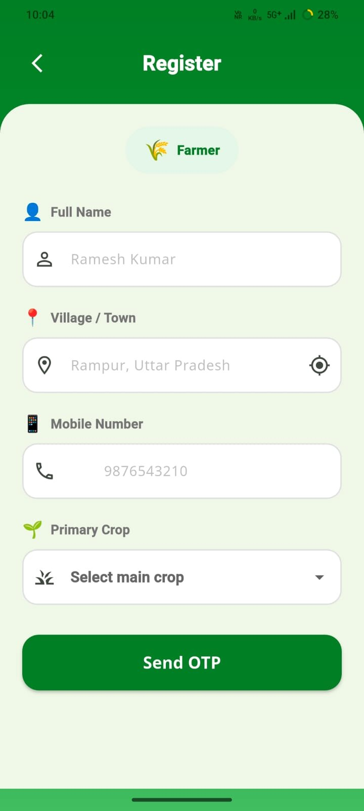
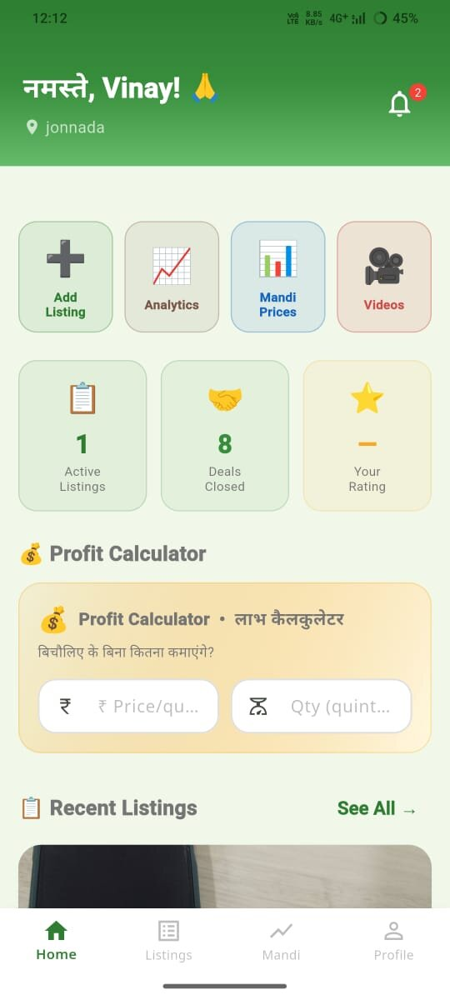
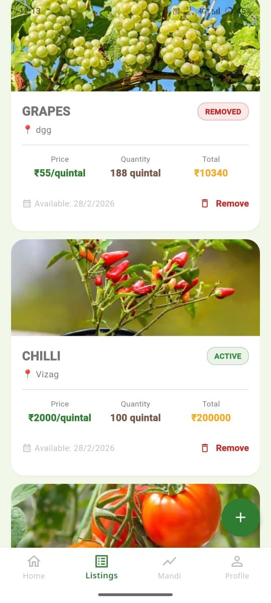
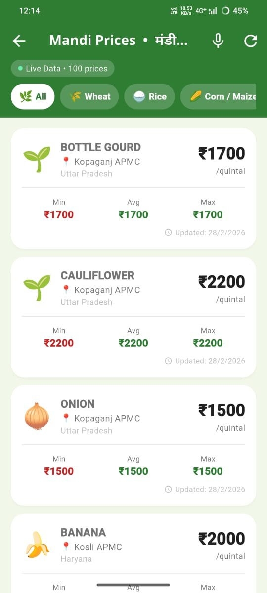
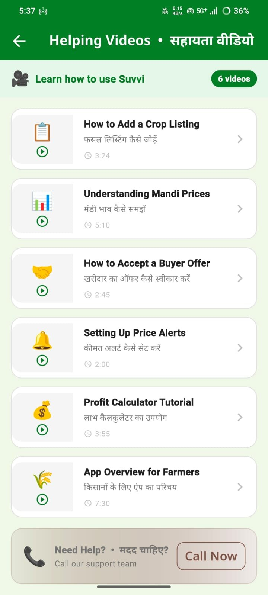
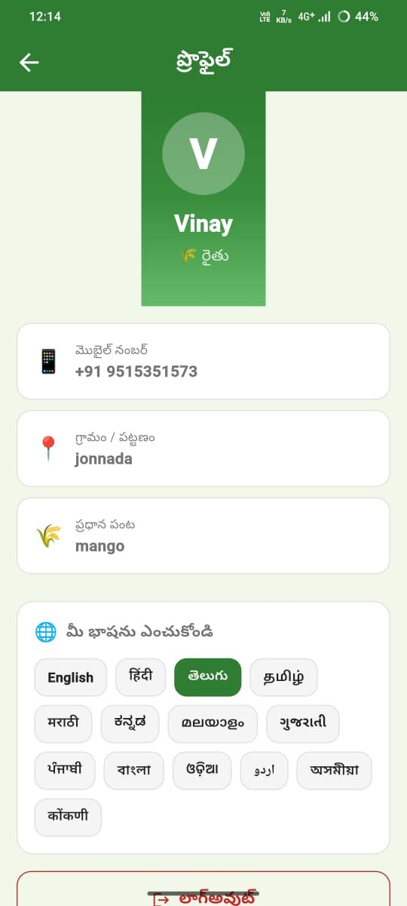

# Suvvi — Farm to Market

**किसान की ताकत, बाजार की शक्ति**
Farmer Power. Market Strength.

India has over **150 million smallholder farmers**, yet most earn only 30–40% of the final retail price for their crops because of a long chain of middlemen. Suvvi cuts them out entirely.

**Farmers** list their crops with a photo, price, and quantity. **Buyers** browse live listings, filter by crop and location, and connect instantly via call or WhatsApp. Direct. Simple. Fair.

## ⬇️ Download APK

[Download Suvvi APK](https://drive.google.com/uc?export=download&id=1hd9o2Kk_BEclJrkyLN-pBDKX7-PNeuMB)

## 👥 Meet the Team

| Name                               | GitHub Profile                               |
| ---------------------------------- | -------------------------------------------- |
| Dola Urmila                        | [@dolaurmila](https://github.com/dolaurmila) |
| Vana Vandana                       | [@vandanavana](https://github.com/vandanavana) |
| S Harshitha Siri Lakshmi Sameera | [@siri-1305](https://github.com/siri-1305)   |
| G Venkata Vinay Kumar              | [@vinaykumar069](https://github.com/vinaykumar069) |

## 📱 Screenshots

### Onboarding
- Splash Screen

- Language Selection

- Role Selection

- Registration

### Farmer Features
- Farmer Dashboard

- Crop Listings

- Live Mandi Prices

- Learning Videos

- My Profile

## ✨ Features

### 🌾 For Farmers
- 📸 **Snap & List**: Take a photo and create a crop listing in under 60 seconds
- 📊 **Live Mandi Prices**: Real-time wholesale prices from across India with ↑↓ trend indicators
- 💰 **Profit Calculator**: See exactly how much more you earn by selling directly vs. through a middleman
- 📦 **Order Management**: Accept or decline buyer offers right from the app
- 🔔 **Price Alerts**: Get notified when mandi prices cross your target threshold
- 🎥 **Helping Videos**: Step-by-step tutorials in your regional language

### 🛒 For Buyers
- 🔍 **Search & Filter**: Filter crops by type, location, price range, and farmer rating
- 🎙️ **Voice Search**: Search by speaking in Hindi or your regional language
- 📞 **Direct Contact**: One-tap call or WhatsApp the farmer directly — no middleman
- ⭐ **Ratings System**: Rate farmers on quality, delivery, and communication

## 🛠️ Built With
- 📱 **Flutter**: Cross-platform Android app from a single codebase
- 🔐 **Firebase Auth**: Phone OTP login — secure and instant verification
- 🗄️ **Supabase**: Database, image storage & real-time order updates
- 📡 **data.gov.in API**: Live mandi & wholesale market prices from across India
- 🎙️ **Speech to Text**: Voice search in Hindi & regional languages
- 🌿 **Riverpod**: Reactive state management for a smooth, fast UI

## 🌍 Language Support
- English
- हिंदी (Hindi)
- తెలుగు (Telugu)
- தமிழ் (Tamil)
- मराठी (Marathi)
- ಕನ್ನಡ (Kannada)
- മലയാളം (Malayalam)
- ગુજરાતી (Gujarati)
- ਪੰਜਾਬੀ (Punjabi)
- বাংলা (Bengali)
- ଓଡ଼ିଆ (Odia)
- اردو (Urdu)
- অসমীয়া (Assamese)
- कोंकणी (Konkani)

## 📥 How to Install
1. Click the **Download Suvvi APK** button above.
2. Download the **suvvi-release.apk** file to your Android phone.
3. Open the downloaded file on your phone.
4. If prompted, allow **"Install from unknown sources"** in your settings.
5. Tap **Install** and open Suvvi 🌾.
To use the app, you will need the test phone numbers added in the firebase authentication system, DM me on My Linkedin to get your mobile number added or to get already added Numbers and OTPs.

[Linkedin](https://www.linkedin.com/in/gvvk)

⚠️ Since this app is not yet on the Play Store, you need to allow installation from unknown sources. The APK is built and signed by our team and is completely safe.

Built with ❤️ for India's 150 million farmers
⭐ Star this repo if you support empowering rural India!
